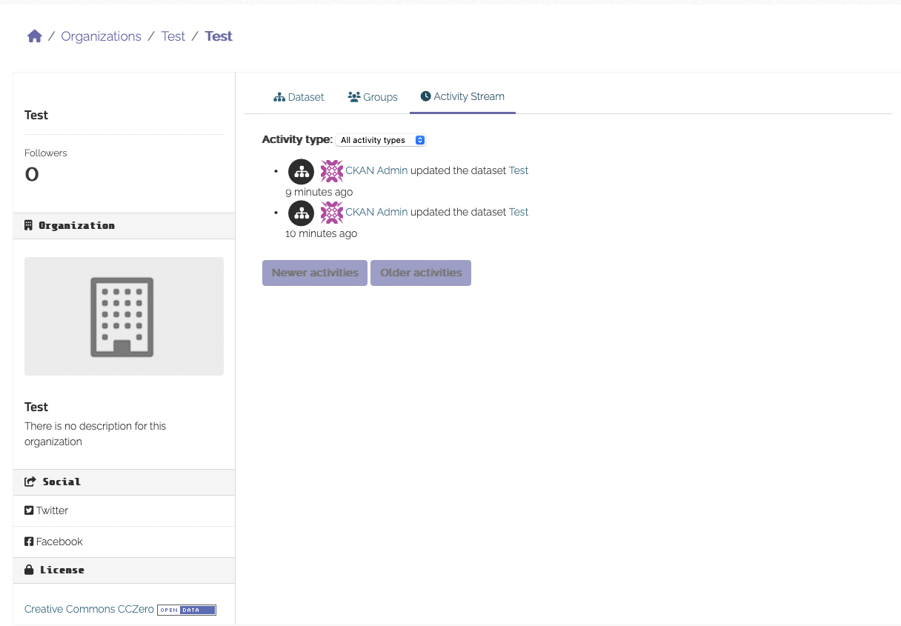

<!--
SPDX-FileCopyrightText: 2024 Stichting Health-RI
SPDX-FileContributor: PNED G.I.E.

SPDX-License-Identifier: CC-BY-4.0
-->

A full history of dataset changes is now displayed in the Activity Stream to admins, and optionally to the public. By default, this feature is enabled for new installations but is disabled for sites which upgrade, to prevent the exposure of potentially sensitive history. It is recommended for open data CKANs that are upgrading to make this history public. This can be achieved by setting the following in the `ckan.ini` file:

```ini
ckan.auth.public_activity_stream_detail = true
```

More about ckan activity settings: https://docs.ckan.org/en/2.10/maintaining/configuration.html

If you have expericience with older versions of CKAN: since 2.10 Activity needs to be activated as plugin. See changelog https://docs.ckan.org/en/2.10/changelog.html

With the right permission. You can view activities at dataset level or at organisation level




And the dif view


