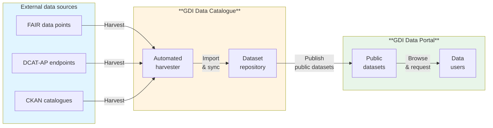

# About dataset harvesting

Dataset harvesting allows you to import and synchronise datasets from external data sources automatically by connecting them to your GDI Data Catalogue. When the source updates, your catalogue synchronises the changes.

**Use harvesting when you need to:**
- Collect datasets from partner organisations or multiple European data portals
- Stay synchronised with external data repositories
- Reduce manual data entry and maintenance effort

**What gets harvested:**
- Dataset metadata (titles, descriptions, keywords)
- Resource links (URLs to data files)
- Contact information and licences
- Update timestamps and versioning information

## Harvesting workflow

The diagram below shows how data flows from external sources through the GDI Data Catalogue to the public-facing GDI Data Portal:

## Supported source types

The GDI Data Catalogue can harvest from:

- **FAIR Data Points:** Research data repositories that follow FAIR principles
- **DCAT-AP endpoints:** European data portals using the DCAT-AP standard
- **CKAN catalogues:** Other CKAN instances operated by partner organisations

[Learn how to add harvest sources →](./add-harvest-sources)

## How harvesting works  

<!-- Note to reviewer: This especially needs your review - please check the accuracy of these statements -->

- **Initial setup:** Connect your data source by configuring a harvest source in the catalogue. You specify the source URL, type, and authentication details.

- **First harvest:** The harvester performs an initial import of all datasets from the source into your catalogue. The initial import starts automatically at the next quarter-hour boundary (:00, :15, :30, or :45). For example, if you set up the source at 10:31, the first harvest starts at 10:45. 

- **Scheduled harvests:** After the first harvest completes, the harvester runs automatically on a daily schedule at the same quarter-hour boundary. This ensures consistent, predictable harvest timing for monitoring and troubleshooting. Following the same example above, subsequent harvests would occur daily at 10:45.

- **Change detection:** During each scheduled harvest, the harvester compares the source data with the existing datasets.
    - New datasets from the source are added to your catalogue
    - Updated datasets are refreshed with current metadata
    - Datasets deleted at the source are removed from your catalogue
    - All changes are logged for review

- **Publication to Data Portal:** Public harvested datasets appear in the [GDI Data Portal](https://portal.gdi.lu/)↗ after import to the catalogue. Private datasets remain visible only to members of your organisation. 