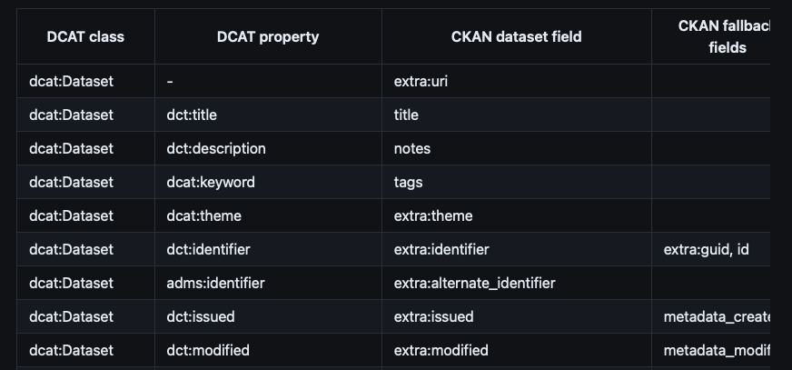

<!--
SPDX-FileCopyrightText: 2024 PNED G.I.E.

SPDX-License-Identifier: CC-BY-4.0
-->

# CKAN architecture

The GDI platform extends CKAN, an open-source data catalogue platform, with custom plugins for DCAT-AP 3 support, OIDC authentication, and harvesting.

## CKAN extension structure

Key components of the `ckanext-gdi-userportal` extension include:

```
ckanext-gdi-userportal/
├── ckanext/
│   └── gdi_userportal/
│       ├── plugin.py               # Main plugin implementation
│       ├── scheming/               # Schema definitions
│       │   └── schemas/
│       │       └── gdi_userportal.json  # DCAT-AP 3 schema
│       ├── templates/              # Jinja2 templates
│       ├── auth.py                 # Authentication logic
│       ├── validators.py           # Field validators
│       └── helpers.py              # Template helper functions
├── setup.py                        # Python package config
└── test/                           # pytest tests
```

## Key concepts

- **IPlugin interface:** CKAN extensions implement the `IPlugin` interface to hook into CKAN's core functionality.
- **Scheming extension:** GDI uses `ckanext-scheming` to define custom metadata schemas in JSON/YAML format.
- **Templates:** Jinja2 templates override CKAN's default UI.
- **Validators:** Custom validators ensure data quality for metadata fields.

## Database structure

Understand CKAN's PostgreSQL database schema to develop extensions that interact with dataset metadata and harvesters.

### Dataset tables

In demo schema `ckan_ckan_dataplatform_nl` table `package`, columns are core fields of CKAN, and `package_extra` for every other field. Every field which extends the core schema lands in the extra table.

The Scheming extension of Civity allows more flexibility for managing extra fields than CKAN core default functionality, but still such a field is converted to a string and lands in the extra table.

It is possible to write a mapper to and map all the extra fields. For DCAT there is an official extension:  
[https://github.com/ckan/ckanext-dcat#json-dcat-harvester](https://github.com/ckan/ckanext-dcat#json-dcat-harvester) It is compatible with DCAT-AP v1.1 and 2.1



### Harvester tables

In the database, the following tables are dedicated to store harvester-related information:

- `harvest_source` - harvested sources are defined
- `harvest_object` - the table where all the objects from a source are saved. Data from a source are stored in `harvest_object.content` and from there will be converted to a CKAN dataset.

Harvesters are also saved to the `package` table of `type` harvest.

After changing something in the database directly, trigger re-indexing in Solr via search-index rebuild of [CLI](https://docs.ckan.org/en/2.9/maintaining/cli.html).
