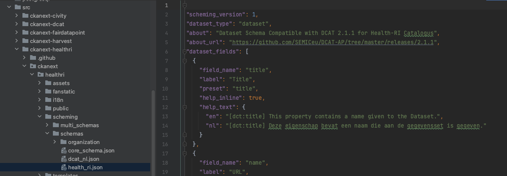

<!--
SPDX-FileCopyrightText: 2024 Stichting Health-RI
SPDX-FileContributor: PNED G.I.E.

SPDX-License-Identifier: CC-BY-4.0
-->

# Work with CKAN schemas

Configure, replace, and maintain dataset schemas in CKAN with JSON or YAML format. 

In this guide  

> [Schema format and fields](#schema-format-and-fields)  
> [Change schema in a running CKAN instance](#change-schema-in-a-running-ckan-instance)  
> [Declare multiple schemas](#declare-multiple-schemas)


## Schema format and fields 

Define CKAN schemas as JSON or YAML files. Civity continues to use .json schemas, while the official documentation includes many YAML references.

A field in a CKAN schema .json file uses the following format:

```java
{
  "field_name": "license_id",
  "label": "License",
  "form_snippet": "license.html",
  "help_inline": true,
  "help_text": {
    "en": "[dct:license] This property refers to the licence under which the Dataset is made available.",
    "nl": "[dct:license] Deze eigenschap heeft betrekking op de licentie waaronder de Dataset beschikbaar wordt gesteld."
}
```

where:

* `field_name` is CKAN field id
* `label` is UI field representation
* `help_text` is text that appears beneath a field in the UI next to the `i` icon. Square brackets are omitted and in this particular example contain information about how this field maps to DCAT-AP. Read more about these mappings and custom fields in [CKAN DB Structure and Fields Mapping Strategy](https://health-ri.atlassian.net/wiki/spaces/HD/pages/184811642/WIP+CKAN+DB+Structure+and+Fields+Mapping+Strategy).

    :::tip Schema documentation

    Refer to the documentation for field keys and schema specifications: [CKAN GitHub official repository.](https://github.com/ckan/ckanext-scheming/tree/release-3.0.0#field-keys).

    :::

Additional field keys include:

* `repeating_subfields`: Defines repeating field groups within a dataset schema. May be useful for handling cardinality issues. Not currently used by Civity.

* `start_form_page`: Controls which multi-page form stage displays the field (recently added feature). Determines field placement across the dataset creation workflow stages. Not currently used by Civity.

* `choices`: Defines static dropdown options as a list of dictionaries with `value` and `label` keys.

* `choices_helper`: Generates dropdown options dynamically from an API or another schema field. For example, you can reference another schema and retrieve field values from it.

* `presets`: Applies predefined field configurations such as `radio`, `multiple_checkbox`, or `date`. Enables automatic validation and rendering without defining custom snippets.

* `form_snippet`: Defines custom field input rendering using Jinja2 templates. Interacts with CKAN UI to customize field representation for data input. Use when presets don't provide sufficient control.

* `display_snippet`: Defines custom field display rendering using Jinja2 templates. Interacts with CKAN UI to control how stored values appear (e.g., rendering email addresses as clickable `mailto:` links).

* `display_property`: Overrides the RDF property representation for the field. Useful when mapping CKAN fields to specific DCAT vocabulary terms. For example, mapping to DCAT:

    ```java
    - field_name: author
    label: Author
    display_property: dc:creator
    ```

* `validators`: Validates field data using CKAN's built-in validation functions (see the [complete list of available functions](https://docs.ckan.org/en/2.9/extensions/validators.html)). Custom validators can also be added. By default, minimal validation is applied: `ignore_missing` (accepts missing values) and `unicode` (text encoding). 
    - **When defining custom validators**, explicitly include these default validators if needed. 
    - **To create custom validation functions**, implement an extension with the `IValidators` interface that returns your validation function from the `get_validators()` method. 
    
    See the [validation functions documentation](https://docs.ckan.org/en/2.9/extensions/validators.html) for implementation details.

* `output_validators`: Handles deserialization when retrieving fields from the database. Complex data structures assigned to a field are converted to strings when stored in the database. This property defines validators for extracting the field from the database and converting it back to its object representation.

## Change schema in a running CKAN instance

Define the schema in `setup_scheming.sh` by setting

```bash
ckan config-tool $CKAN_INI -s app:main \
    "scheming.dataset_schemas = ckanext.healthri:scheming/schemas/gdi_userportal.json"\
    "scheming.presets = ckanext.scheming:presets.json"\
    "scheming.dataset_fallback = false"
```

where `ckan config-tool` forms part of the [CKAN Command Line Interface](https://docs.ckan.org/en/2.9/maintaining/cli.html#). Review the [documentation](https://docs.ckan.org/en/2.9/maintaining/cli.html#config-tool-tool-for-editing-options-in-a-ckan-config-file) for more information on `config-tool` usage.

In a running Docker container, the configuration file `srv/app/ckan.ini` defines this in the `scheming.dataset_schemas` parameter. This should reference an extension under the `/src/` directory of the `ckan-docker` repository.

To replace the schema, run:

```bash
docker exec -it ckan /bin/sh
vi /srv/app/ckan.ini # change the schema
```

Changing the `ckan.ini` file triggers a CKAN update, applying changes almost immediately.

Define schemas in the following format: `<extension name with dashes replaced with dots>`:`<path to shema .json file>`. Clone the extension under `/ckan-docker/src`.

The path from the example above (`ckanext.healthri:scheming/schemas/gdi_userportal.json`) resolves to the following:



## Declare multiple schemas

Scheming uses the [IDatasetForm](https://docs.ckan.org/en/2.9/extensions/adding-custom-fields.html#) interface to override schemas.

### In CKAN.ini file

Define multiple (space-separated) values in `scheming.dataset_schemas`. CKAN core and Civity-extended CKAN differ in behaviour: core CKAN picks the latest schema when two share the same `dataset_type` field. Civity improves this by merging schemas of the same type, reflecting the order specified in `scheming.dataset_schemas` in the CKAN UI field order.

The `ckanext.scheming.overwrite_fields` parameter defines rules for merging. When set to `true`, and schemas to merge share fields, the system prioritises definitions from the latest schema. Fields are never deleted; they can only be added or modified. To delete a field, undeclare it or explicitly set it to empty. The system implements this behaviour in `ckanext-scheming/ckanext/scheming/plugins.py` (`_combine_schemas`) and documents it only at code level.

### In a multischeming declaration .json file

Civity initially implemented this to allow extensions to have their own schema merged into the core schema.

For maintenance purposes, provide a .json config file under `ckanext-healthri/ckanext/healthri/scheming/schemas/` instead of managing schemas in the ckan.ini file, with content like the following:

```java
[
  {
   "dataset_type": "dataset",
   "about": "Dataset",
   "about_url": "https://dataplatform.nl/what-is-a-dataset",
   "schemas": [
      "ckanext.healthri:scheming/schemas/core_schema.json",
      "ckanext.healthri:scheming/schemas/health_ri.json"
    ]
  }
]
```

This also allows several schemas simultaneously, e.g.:

```java
[
  {
   "dataset_type": "dataset",
   "about": "Dataset",
   "about_url": "https://dataplatform.nl/what-is-a-dataset",
   "schemas": [
      "ckanext.healthri:scheming/schemas/core_schema.json",
      "ckanext.healthri:scheming/schemas/health_ri.json"
    ]
  },
  {
   "dataset_type": "geo_dataset",
   "about": "Geo Document",
   "about_url": "https://dataplatform.nl/what-is-a-geo-document",
   "schemas": [
      "ckanext.healthri:scheming/schemas/geo_document.json"
    ]
  }
]
```

Add the `scheming.dataset_multi_schemas` property to the ckan.ini file with a path to the schemas file, e.g.:

```
scheming.dataset_multi_schemas = ckanext.healthri:scheming/schemas/multi_schemas.json
```

[Civity documentation on multiple schemas configuration.](https://github.com/CivityNL/ckanext-scheming/tree/release-3.0.0-civity#configuration)

Control which datasets are declared via the API:

```java
GET http(s)://<ckan-host>/api/action/scheming_dataset_schema_list
```

and then

```java
GET http(s)://<ckan-host>/api/action/scheming_dataset_schema_show?type=<dataset_type>
```

UI search of all dataset types is configured in `ckan.search.show_all_types` parameter (see [documentation](https://docs.ckan.org/en/latest/maintaining/configuration.html#search-settings)).
