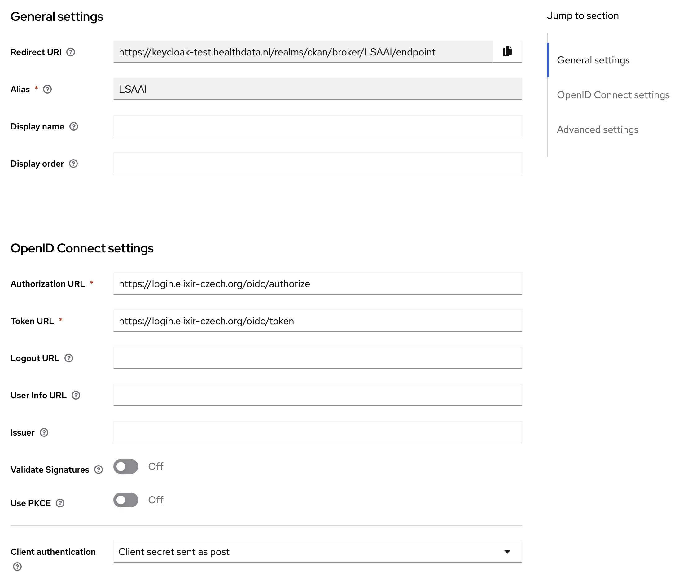
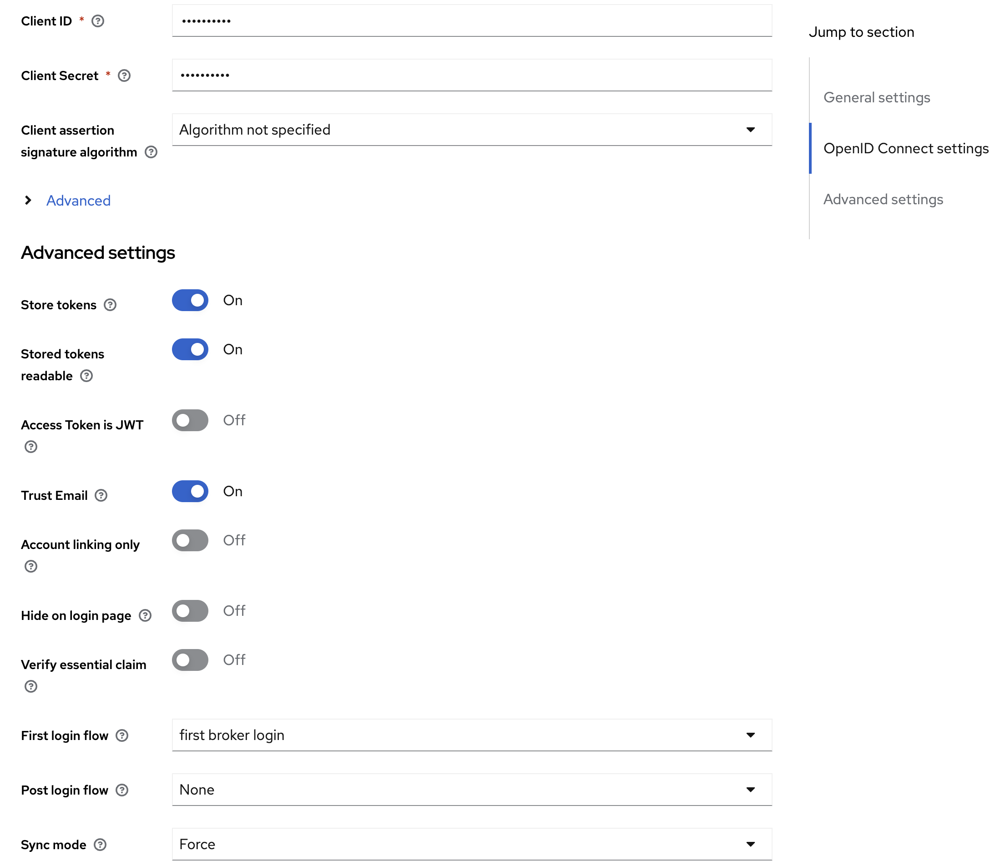

# Configure LS-AAI in Keycloak

Configure identity providers (IdPs) in Keycloak to enable federated authentication through **LS-AAI** and **Azure AD**. This guide covers OpenID Connect setup, attribute mapping, and token configuration.

## Prerequisites

- Keycloak instance deployed and accessible
- Admin access to Keycloak
- LS-AAI service registration completed (see [LS-AAI service providers](https://elixir-europe.org/platforms/compute/aai/service-providers))
- Azure AD app registration configured (if using Azure AD)

## Identity provider configuration requirements

When configuring identity providers, you will need the following information for OpenID setup:

- **ClientSecret:** Provided by the IdP during registration
- **ClientId:** Unique identifier for your application
- **Token URL:** OAuth2 token endpoint
- **Authorisation URL:** OAuth2 authorisation endpoint
- **Redirect URI:** Keycloak callback URL

The Token URL and Authorisation URL are derived from the IdP. When registering a service, you acquire the ClientId and ClientSecret. The Redirect URI, which remains constant, is provided by Keycloak:

`https://{app_name_azure}.azurewebsites.net/auth/realms/master/broker/azuread/endpoint`

## Configure Azure AD integration

Configure Azure Active Directory as an identity provider in Keycloak.

### Register application in Azure AD

Manage app registration in the Azure portal at [portal.azure.com](https://portal.azure.com).

For detailed Azure integration steps, refer to the tutorial at [https://www.youtube.com/watch?v=LYF-NLHD2uQ](https://www.youtube.com/watch?v=LYF-NLHD2uQ), which explains both service registration and Azure AD setup within Keycloak.

### Configure Azure AD in Keycloak

Set up Azure AD as an identity provider with the following configuration:

- **Scopes:** `openid`, `profile`, `email`, `elixir_id`
- **Method:** POST the ClientSecret
- **Sync method:** Import

## Configure LS-AAI integration

Configure LS-AAI (Life Science Authentication and Authorisation Infrastructure) as an identity provider in Keycloak.

### Register Keycloak with LS-AAI

Register Keycloak as a service with LS-AAI:

1. **Obtain an LS-AAI account:** Create an account if you do not have one.
2. **Register your organisation:** Ensure your organisation is recognised as an IdP and register if not.
3. **Submit service registration:** Submit a registration for your application as a service. Approval for this step may take some time.

Manage your app registration at [https://services.aai.lifescience-ri.eu](https://services.aai.lifescience-ri.eu).

### Configure LS-AAI in Keycloak

Set up LS-AAI as an identity provider in Keycloak with the following settings:

- **Discovery endpoint:** [https://login.elixir-czech.org/oidc/.well-known/openid-configuration](https://login.elixir-czech.org/oidc/.well-known/openid-configuration)
- **Scopes:** `openid`, `profile`, `email`, `elixir_id`
- **Sync mode:** Import (not force)
- **Store tokens:** Enabled to allow User Portal components to get LS-AAI `access_token` for Beacon Network integration via OAuth2
- **Stored tokens readable:** Enabled

Here's an example of the LS-AAI configuration in Keycloak:




:::info Additional configuration steps

- **You need additional mapper** for `elixir_id` to properly configure the attribute mapping in Keycloak.
- **When you first log in**, the system will ask if you want to join the test environment. Select to agree and proceed.

:::

## Fetch LS-AAI access token from Keycloak

Access tokens from LS-AAI (or any IdP) can be fetched through Keycloak using one of the following methods.

### Method 1: Direct API call

Configure Keycloak and request LS-AAI tokens through the API:

1. **Go to Keycloak Admin:** Navigate to Identity Providers, then LS-AAI Provider Details.

2. **Enable token storage:** Enable `Store Tokens` and `Stored tokens readable`.

3. **Reinitialise users:** Delete LS-AAI existing users to ensure users are initialised correctly in Keycloak.

4. **Log in with LS-AAI user:** Authenticate using an LS-AAI user account.

5. **Call Keycloak endpoint:** Make a GET request to fetch the token:

```
GET https://keycloak-test.healthdata.nl/realms/ckan/broker/LSAAI/token
Authorisation: {keycloak_access_token}
```

### Method 2: Configure OAuth 2.0 in Postman

Set up OAuth 2.0 authorisation in Postman to obtain the LS-AAI token.

1. **Open Postman application:** Launch Postman on your desktop.

2. **Select a request:** Choose an existing request from your collections, or create a new one by selecting New, then Request.

3. **Go to Authorisation tab:** Navigate to the Authorisation tab within the selected request.

4. **Set authorisation type:** From the Type dropdown menu, select OAuth 2.0.

5. **Add authorisation data to request headers:** In the Add authorisation data to dropdown, select Request Headers.

6. **Configure current token:** For the Current Token section, choose Bearer as the token type.

7. **Configure new token:** Set up the token with the following parameters:
   - **Token Name:** Enter a name for your token
   - **Grant Type:** Select Authorisation Code from the dropdown menu
   - **Authorise Using Browser:** Ensure this box is checked to use your default web browser for authorisation
   - **Auth URL:** Replace `{keycloak_url}` and `{realm_name}` with your Keycloak server and realm:
     ```
     {keycloak_url}/realms/{realm_name}/protocol/openid-connect/auth
     ```
   - **Access Token URL:** Fill in the Keycloak server and realm information:
     ```
     {keycloak_url}/realms/{realm_name}/protocol/openid-connect/token
     ```
   - **Client ID:** Enter `ckan` or the specific client ID you have been provided
   - **Client Secret:** Enter the client secret you obtained from Keycloak that corresponds to your client ID
   - **Scope:** Enter `openid profile email elixir_id`
   - **Client Authentication:** Select Send as Basic Auth header from the dropdown menu

8. **Obtain access token:** Select the Get New Access Token button to initiate the OAuth 2.0 authorisation flow.

After completing these steps, you will receive an access token that contains an `elixir_id` and can be used to authorise your requests within Postman.

:::tip Next steps

After configuring LS-AAI in Keycloak:

- [Manage user roles and permissions](/system-admin-guide/manage-user-roles): Configure user access levels.
- [Manage data and services](/system-admin-guide/manage-data-services): Set up CKAN and data sources.
- [Monitor and maintain the system](/system-admin-guide/monitor-maintain): Set up monitoring and logging.

:::

