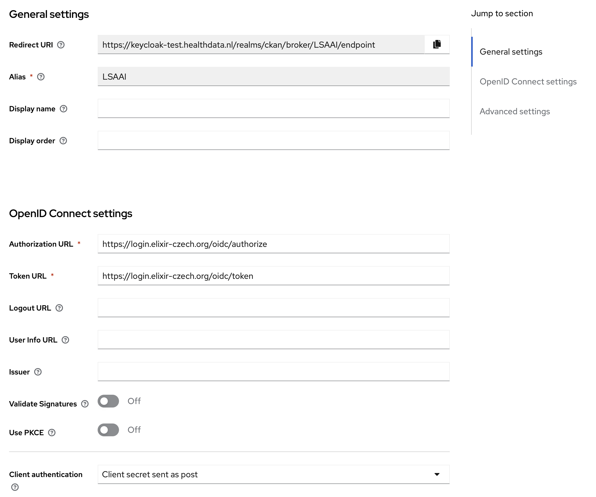
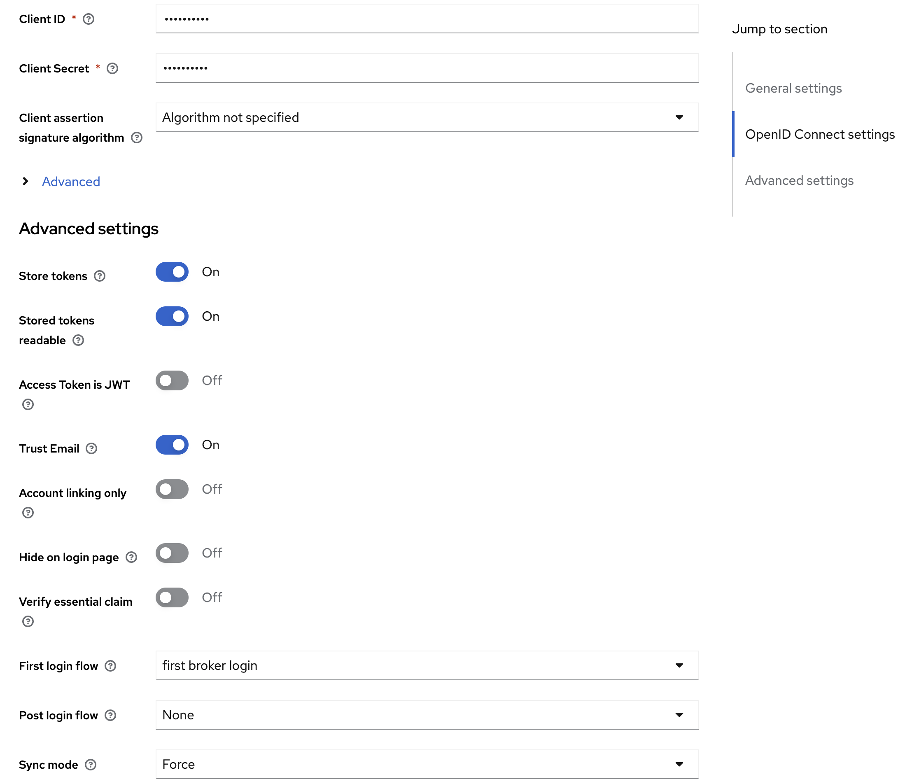

# Configure LS-AAI in Keycloak

Keycloak can be obtained by running the CKAN deployment script that you can find in the following guide: [Azure CLI Script Deployment Guide](./../deployment/azure)

## Configuring Identity Providers (IdPs)

When configuring identity providers (IdPs), the following information becomes crucial for OpenID setup:

* ClientSecret
* ClientId
* Token URL
* Authorization URL
* Redirect URI

Both the 'Token URL' and 'Authorization URL' are derived from the IdP. When registering a service, you acquire the clientId and secret. The 'Redirect URI', which remains constant, is provided by Keycloak:  
[https://{app_name_azure}.azurewebsites.net/auth/realms/master/broker/azuread/endpoint](https://{app_name_azure}.azurewebsites.net/auth/realms/master/broker/azuread/endpoint)

Additionally, the corresponding configuration entails:

* Scopes: "openid", "profile", "email" , "elixir_id"
* Method: POST the Clientsecret
* Sync method: import

For Elixer_id additional mapper is needed

#### Azure AD

For Azure integration, I followed the tutorial at [https://www.youtube.com/watch?v=LYF-NLHD2uQ.](https://www.youtube.com/watch?v=LYF-NLHD2uQ.) This tutorial comprehensively explains both the service registration and the Azure AD setup within Keycloak. Management of the app registration is done within our Ad: [portal.zure.com](http://portal.zure.com)


### LSAAI

To register Keycloak as service I used [https://elixir-europe.org/platforms/compute/aai/service-providers.](https://elixir-europe.org/platforms/compute/aai/service-providers.) .  
Initially, obtaining an account is the first step. 1. Make sure your organisation is recognised as IdP and register if not. 2. Submit a registration for you application as a service. Please note that approval for this step may entail a waiting period.  
  
Management of the app registration is done within: [https://services.aai.lifescience-ri.eu](https://services.aai.lifescience-ri.eu) .

Discovery endpoint: [**https://login.elixir-czech.org/oidc/.well-known/openid-configuration**](https://login.elixir-czech.org/oidc/.well-known/openid-configuration)

The LSAAI configuration looks like:  



Note 1: Sync mode must be "import" instead of "force"\
Note 2: `Store tokens` and `Stored tokens` must be on, to allow User Portal components to get LS-AAI `access_token`. That enables Beacon Network integration via Oauth2.\

The first time you log in you will get a question if you want to be a member of the test environment. Agree and proceed.

## Fetching LS-AAI Access Token from Keycloak

### Option 1 

In order to fetch access token from LS-AAI - or any IdP - one needs to configure Keycloak accordingly, and later request to Keycloak LS-AAI tokens.

1. Go to `Keycloak Admin \ Identity Providers \ LS-AAI Provider Details`;
2. Enable `Store Tokens` and `Stored tokens readable`;
3. Delete LS-AAI existing users, to ensure users are initialised correctly in Keycloak;
4. Login with a LS-AAI user;
5. Call Keycloak endpoint:
```
GET https://keycloak-test.healthdata.nl/realms/ckan/broker/LSAAI/token
Authorization: {keycloak_access_token}
```

### Option 2: Configuring OAuth 2.0 in Postman

This guide will help you set up OAuth 2.0 authorization for a request in Postman and obtaining the LSAAI token.

#### Steps to Configure OAuth 2.0

1. **Open Postman Application**
   Begin by opening the Postman application on your desktop.

2. **Select a Request**
   - Choose any existing request from your collections, or create a new one by clicking on the 'New' button and selecting 'Request'.

3. **Authorization Setup**
   - Navigate to the 'Authorization' tab within the selected request.

4. **Set Authorization Type**
   - From the 'Type' dropdown menu, select 'OAuth 2.0'.

5. **Add Authorization Data to Request Headers**
   - In the 'Add authorization data to' dropdown, select 'Request Headers'.

6. **Current Token Configuration**
   - For the 'Current Token' section, choose 'Bearer' as the token type.

7. **Configure New Token**
   Follow the steps below to configure a new token:

   - **Token Name**: Enter a random name for your token.
   
   - **Grant Type**: Select 'Authorization Code' from the dropdown menu.
   
   - **Authorize Using Browser**: Ensure this box is checked to use your default web browser for the authorization.
   
   - **Auth URL**: Replace `{keycloak url}` and `{realm_name}` with the appropriate values for your Keycloak server and realm.
     ```
     {keycloak url}/realms/{realm_name}/protocol/openid-connect/auth
     ```
   
   - **Access Token URL**: Similar to the Auth URL, fill in the Keycloak server and realm information.
     ```
     {keycloak url}/realms/{realm_name}/protocol/openid-connect/token
     ```
   
   - **Client ID**: Enter 'ckan' or the specific client ID you have been provided.
   
   - **Client Secret**: Enter the client secret you obtained from Keycloak that corresponds to your client ID.
   
   - **Scope**: Input the scopes as `openid profile email elixir_id`.
   
   - **Client Authentication**: Select 'Send as Basic Auth header' from the dropdown menu.

8. **Obtain Access Token**
   - Click on the 'Get New Access Token' button to initiate the OAuth 2.0 authorization flow.

After completing these steps, you should be able to receive an access token that can be used to authorize your requests within Postman, which is containing also an Elixer Id
