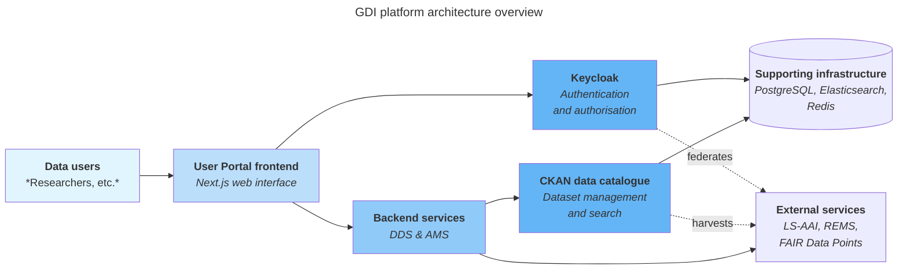

# Platform overview

The **GDI platform** consists of the following components that work together to provide federated access to genomic datasets across Europe.

### Frontend layer

**User Portal frontend:** Built with Next.js, provides a web interface for interacting with key services, including the Dataset Discovery Service (DDS) and the Access Management Service (AMS). It acts as the primary user interface for the GDI project.

### Backend services

**Dataset Discovery Service (DDS):** Acts as a backend layer mediating requests from the frontend to CKAN's data catalogue APIs. It retrieves, processes, and maps dataset information while abstracting CKAN-specific logic.

**Access Management Service (AMS):** Ensures secure interactions between the frontend and backend data authorities. It provides APIs for managing user access requests and integrates with external APIs like REMS to enforce policies and track user actions.

### Core services

**CKAN:** Open-source data management system for publishing, sharing, and discovering datasets. It enables cataloguing, searching, and accessing data through a web interface and API. The User Portal uses several custom extensions, including GDI Userportal Ckanext (core GDI functionality) and Fair Datapoint Ckanext (FAIR principles support).

**Keycloak:** Authentication and authorisation service managing user sessions, roles, and permissions across all platform components. It integrates with LS-AAI to enable users to authenticate using their existing institutional credentials through the European research federation.

### Supporting infrastructure

**PostgreSQL:** Database for CKAN and Keycloak data storage.

**Elasticsearch/Solr:** Search indexing for dataset discovery and filtering.

**Redis:** Caching layer for improved performance.

**Docker containers:** All components run as Docker containers for consistent deployment and orchestration.
